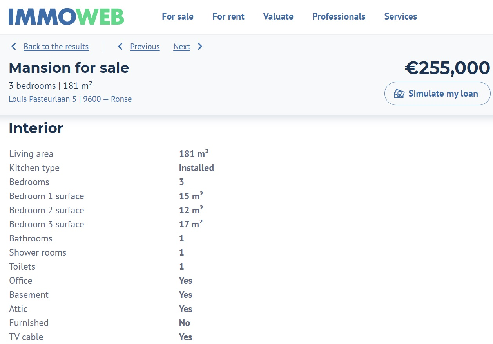
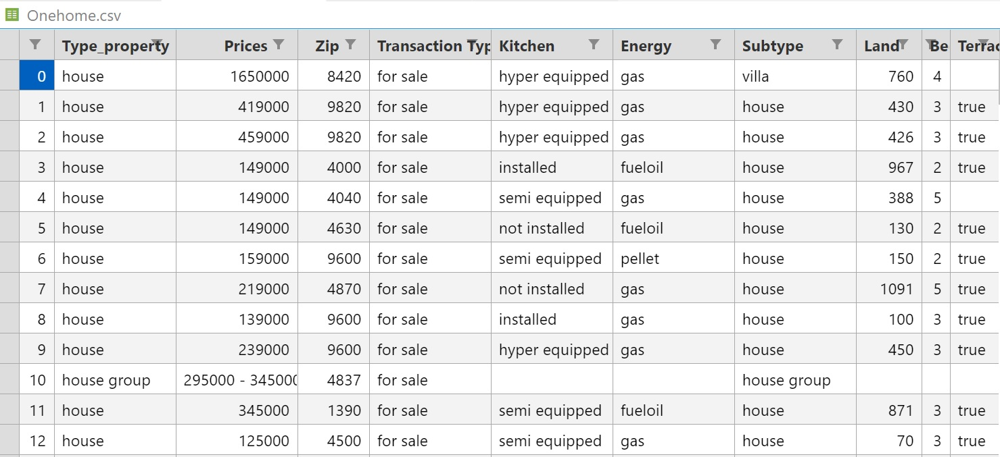

# IMMO scraping

## Description of the program

Our program can be used for scrapping real estate websites. It saves information about property for sale into CSV file. Here are the steps:

1. The program sends request to the page with houses and apartments for sale.
2. It collects links to the pages with detailed information about properties into a separate file.
3. Iterating through the links, the program collects data related to each property such as: location, price, number of bedrooms etc.
4. Collecting information in data frames.
5. Creating CSV file with database.

In our example we gather data from Belgian resource ImmoWeb, but the program can be adapted for scrapping from other resources.

## Installation

The program is based on Python, so be sure you have it installed on your computer.

This the list of the things you need to use the software and how to install them.

1. Clone the repo to your computer.
2. Install Requests  
   `$ pip3 install requests`

3. Install Beautiful Soup  
   `$ pip3 install beautifulsoup4`

4. Install Pandas  
   `$ pip3 install pandas`
5. Install Selenium
   `$ pip3 install selenium`

## Usage

Get the links to the pages of real state objects by running `Get_url.py`. The results will be saved into `url_links.txt` file.

As far as links may have duplicates, we recommend to clean up the result by using Excel. For the moment, our program does not include this function.

Run `Main.py` to get the data about each property. You can set up the range of links (lines) you want to iterate. For now the default values are `[0:100]` You can also configure which properties to fetch and to add into CSV file (number of bedrooms, garden etc.)

The example of CSV file you will get as a result is located in the data folder and is named `Onehome.csv`.

